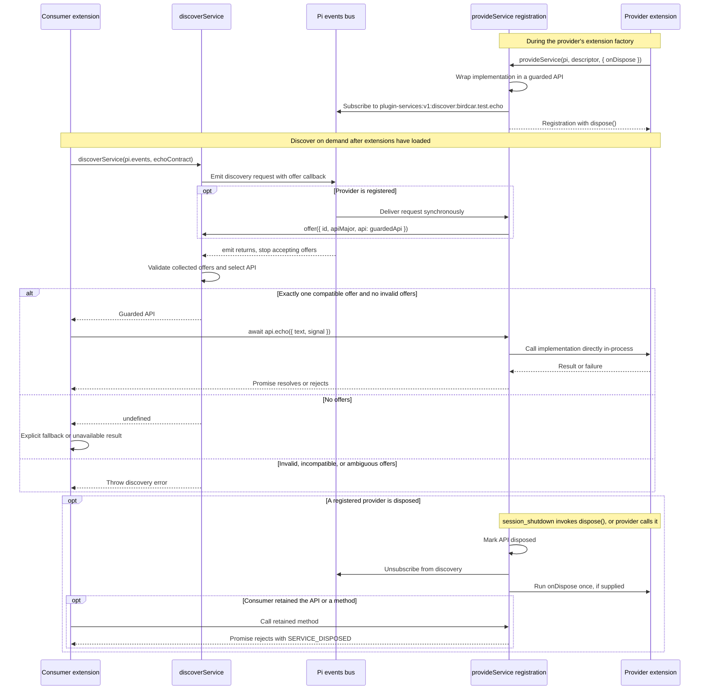

# Pi service discovery protocol

`@birdcar/pi-services` implements protocol `plugin-services:v1` for optional, in-process services
between Pi extensions. It uses Pi's injected `pi.events` bus; it does not load extensions, keep a
global registry, create a bus, or provide RPC.

## Public API

```ts
interface EventBus {
  emit(channel: string, payload: unknown): void;
  on(channel: string, handler: (payload: unknown) => void): () => void;
}
interface ServiceHost {
  events: EventBus;
  on(event: "session_shutdown", handler: () => void | Promise<void>): void;
}
interface ServiceContract<TApi extends object> {
  id: string;
  apiMajor: number;
  isApi(value: unknown): value is TApi;
}
interface ServiceDescriptor<TApi extends object> {
  id: string;
  apiMajor: number;
  api: TApi;
}
interface ServiceRegistration {
  dispose(): Promise<void>;
}
```

Consumers call `discoverService(events, contract)`. Providers call
`provideService(host, descriptor, { onDispose })` during their extension factory.

## How extensions communicate

Provider and consumer extensions agree on a side-effect-free contract containing the service ID, API
major, TypeScript interface, and `isApi` validator. They import the helpers from
`@birdcar/pi-services` and use the same Pi-injected `pi.events` bus, without importing each other's
extension entrypoints.



The registration and discovery participants are helpers inside the extensions, not separate
processes or a central registry. Only discovery travels over `pi.events`; offers use the request's
synchronous callback, and subsequent method calls pass arguments and return promises directly. Late
asynchronous offers are ignored.

Multiple consumers can independently discover and call the same provider without registering
consumer identities. An extension can both provide its own service and discover another extension's
service using a separate contract. Providers own per-request cancellation and shutdown cleanup;
invocation failures propagate rather than triggering the missing-service fallback.

## Protocol and versioning

Discovery emits on `plugin-services:v1:discover:<service-id>`. `v1` is the discovery protocol
version. Each service independently declares an exact `apiMajor`; package semver is separate.
Service IDs are namespaced strings such as `example.search` or `birdcar.test.echo`; this prevents
accidental collisions but is not authentication.

Descriptors expose a flat object of own callable data properties. Accessors, nested method surfaces,
empty APIs, malformed IDs, and invalid majors are contract errors. This POC intentionally does not
build recursive proxies or middleware.

## Selection precedence

Discovery collects only synchronous calls to the request's `offer(descriptor)` callback. Late
microtask/timer offers are ignored. After `emit` returns, the helper validates all collected offers:

- no offers: return `undefined`;
- malformed envelope or requested-major API validation failure: throw `SERVICE_CONTRACT`;
- only well-formed offers for other majors: throw `SERVICE_INCOMPATIBLE`;
- multiple valid matching-major offers: throw `SERVICE_AMBIGUOUS`;
- exactly one valid matching-major offer: return its guarded API.

A contract's `isApi` is only evaluated for matching-major offers. Validator throws are normalized to
`SERVICE_CONTRACT`. Ordinary method failures are not converted to discovery errors.

## Provider and execution responsibilities

Providers synchronously offer a guarded API object, never the raw implementation. Each method
wrapper rejects with `SERVICE_DISPOSED` after provider disposal, including retained or destructured
functions. `dispose()` is idempotent, unsubscribes before cleanup, runs `onDispose` once, and is
registered for `session_shutdown`.

Providers own readiness, input validation, resource lifetime, concurrency, cancellation, and
side-effect approvals. Consumers discover on demand, implement explicit fallback only for
`undefined`, and propagate invocation failures. Service method results must be returned through
promises, not required observational events.

See the type-checked fixtures `../tests/fixtures/services/contract.ts`,
`../tests/fixtures/services/provider.ts`, `../tests/fixtures/services/consumer-a.ts`, and
`../tests/fixtures/services/consumer-b.ts` for a side-effect-free echo service with cancellation and
two independent consumers.
