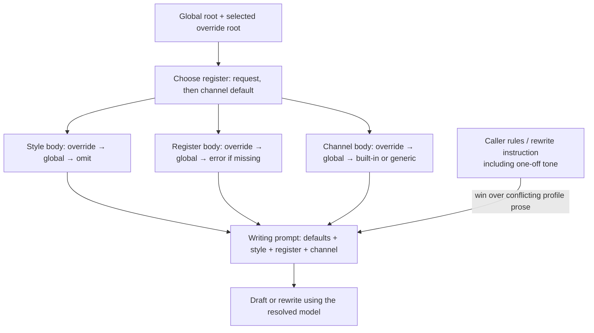

# @birdcar/pi-write-for

`@birdcar/pi-write-for` is a Pi extension for drafting or rewriting text in a configured voice and
channel. Profiles remain plain Markdown/frontmatter; generation is exposed through a service,
`/write-for`, and the Full-scope rewrite event.

## Installation and baseline

Install the extension into Pi with Node `>=22.19.0` and a compatible Pi host:

```sh
npm install @birdcar/pi-services @birdcar/pi-write-for
```

Load `@birdcar/pi-write-for` as a Pi extension. It does not start an external RPC server, require an
application connector, automatically send drafts, or change the main session model. If no profile
metadata names a model, generation uses the active Pi model for that request; a profile `model:`
such as `openai-codex/gpt-5-codex` wins over the active model.

## Profiles

A writing profile combines three kinds of Markdown guidance:

- **Style:** your consistent voice across audiences, such as vocabulary, rhythm, and things to
  avoid.
- **Register:** how you address a particular audience, such as `professional`, `internal`, or
  `social`. Put audience-specific tone here: warm and measured with customers, terse and informal
  with teammates.
- **Channel:** the format and conventions of the destination, such as email subjects, Slack bullets,
  or GitHub Markdown. A channel can select a default register but is not itself a trained voice.

**Tone is prose, not a separate configuration layer.** There is no `tone:` frontmatter field or
`--tone` flag. Describe recurring tone in profile bodies; use request-specific instructions for a
one-off adjustment. Only `model` and channel-only `defaultRegister` are recognized frontmatter
fields.

At least one nonempty register profile is required, whether handwritten or generated by training.
Style is optional. Built-in channels supply formatting and default register names, not register
profiles: `email` and `github` use `professional`, `slack` uses `internal`, and `bluesky` uses
`social`. Custom channels need an explicit register or a saved channel's `defaultRegister`.

### Example profiles

Create these files in a trusted project's `.pi/write-for/`, or use the same layout under
`~/.config/pi-write-for/` to share them across projects:

```text
.pi/write-for/
├── style.md
├── registers/
│   ├── professional.md
│   └── internal.md
└── channels/
    └── email.md
```

**.pi/write-for/style.md** — shared voice:

```markdown
Write concrete, direct prose. Prefer short sentences and familiar words. Use contractions naturally.
Avoid hype, filler, and rhetorical questions. Preserve names, dates, numbers, and links; never
invent missing details.
```

**.pi/write-for/registers/professional.md** — customer-facing register:

```markdown
Be warm, measured, and specific. Lead with the answer, then explain the next step. Acknowledge
inconvenience without excessive apologies. Avoid internal jargon.

Example: "The fix is live. Please retry the import and let me know if it still fails."
```

**.pi/write-for/registers/internal.md** — teammate-facing register:

```markdown
Be concise and informal without becoming cryptic. State the outcome, blocker, and ask. Skip
greetings in ongoing conversations. Use bullets for separate actions.

Example: "Import fix is live. Could someone check the retry path before we close this?"
```

**.pi/write-for/channels/email.md** — email conventions and default register:

```markdown
---
defaultRegister: professional
---

Include a useful subject line, a brief greeting, and a short closing. Keep paragraphs short. End
with one clear next step when action is needed.
```

To pin a generation model, add optional frontmatter to any of these files (or add `model` to an
existing frontmatter block):

```yaml
---
model: openai-codex/gpt-5-codex
---
```

Use a model available and authenticated in your Pi installation. Omit `model` to inherit the next
configured model or, ultimately, the active Pi model. Model metadata does not change the main
session's model.

### Configuration resolution

Global profiles default to `~/.config/pi-write-for/`. The loaded extension does not currently read
`XDG_CONFIG_HOME` automatically; use `PI_WRITE_FOR_CONFIG` for an explicit directory.

The override root is `PI_WRITE_FOR_CONFIG` when set; otherwise it is the nearest ancestor's Pi
project config directory containing `write-for/` (normally `.pi/write-for/`). Only that one project
root is used, not every ancestor. Untrusted project profiles are ignored; an explicit project-local
root requires trust. An explicit root must already exist and replaces project discovery, not the
global fallback.



Resolution has three distinct rules:

1. **Register name:** explicit `--register` (or service `register`) wins, then the override
   channel's `defaultRegister`, then the global channel's `defaultRegister`, then the built-in
   channel default. With no register, generation fails with `REGISTER_REQUIRED`.
2. **Profile bodies:** independently choose the first nonempty body for style, the selected
   register, and the selected channel, as shown above. An override body replaces its global
   counterpart; they are not concatenated. A missing, empty, or frontmatter-only body inherits the
   global body. Without a register body, generation fails with `PROFILE_NOT_CONFIGURED`. Channel
   guidance falls back to built-in formatting, or generic plain text for custom channels.
3. **Model metadata:** use the last specified `model` in this order (missing values are skipped):

   ```text
   active Pi model
     → global style → global selected register → global selected channel
     → override style → override selected register → override selected channel
   ```

   Model selection is independent of body fallback. For example, an override style file containing
   only `model:` can select the model while retaining global style prose; it even outranks a global
   channel's model.

The selected style, register, and channel bodies are all included in the prompt, not merged as
structured tone settings. Caller rules and rewrite instructions take priority over conflicting
profile prose, but cannot change the resolved channel, register, or model by mentioning them in
text.

For example, `/write-for email --register internal` uses the shared style, the `internal` register,
and email formatting, without modifying the email channel's `professional` default. With the service
API, `rules: ["Use a reassuring tone; avoid jokes."]` can adjust just this request.

Manual migration from earlier experiments is copying compatible Markdown into one of these roots;
the extension does not merge legacy directories automatically.

## Commands

```text
/write-for <channel> [--register <name>] [topic]
/write-for <channel> [--register <name>] --rewrite <text>
/train-voice [scope] [--register <name>] [--channel <name>] [--source <folder>] [--global|--project]
/retrain-voice [scope] [--register <name>] [--channel <name>] [--source <folder>] [--global|--project]
```

Training scope is `--style`, `--register <name>`, `--channel <name>`, or `--all`; omit it for an
interactive choice. Put the scope first, then any additional register/channel names (see examples
below).

If `/write-for` topic is omitted, the command summarizes visible user/assistant text from the
current Pi session branch. It does not inspect Git or include tool-call arguments/results.

With the example profiles above, try:

```text
/write-for email The import fix is live; ask the customer to retry.
/write-for slack --register internal The import fix shipped; ask for a retry-path check.
/write-for github Summarize the import fix and its verification steps.
/write-for email --register internal --rewrite Import fixed. Please retry and report any errors.
/write-for newsletter --register professional Announce the import fix in a short product update.
```

The custom `newsletter` channel uses generic formatting until you add its own channel profile. Put
`--register` before `--rewrite`, which consumes all remaining text as the source to rewrite.

## Voice training

Training **distills examples into editable Markdown profiles**; it does not fine-tune a model.
`/train-voice` and `/retrain-voice` require Pi UI/RPC. They start a cooperative main-session
interview about authorship, audience, tone/register, exclusions, allowed sources, manual rules, and
where to save.

### Local documents, MCP connectors, and web tools

**Training is not limited to local documents.** It can use:

- **Local folders:** `--source <folder>` offers a folder to the built-in document ingestion
  pipeline.
- **MCP connectors, web search/fetch, or CLI tools already active in Pi:** the host agent can use
  them, with your authorization, to collect writing samples and pass the extracted text to
  write-for. For example, it could collect your sent emails, your Slack messages, or articles at
  approved URLs.
- **Pasted text:** the host agent can submit text you provide directly, without a folder or
  connector.

Write-for supplies the interview and review tools, **not connectors or a web crawler**. It does not
install or activate tools, probe credentials, or treat a tool's presence as permission.
Connector/web availability and authentication come from your Pi setup. If a tool is unavailable,
configure it separately or export/paste the samples instead. `--source` accepts a local folder, not
a URL or an MCP server name.

The responsibilities are split:

1. The **host agent** uses `write_for_interview` to establish the source scope and permissions, then
   collects authorized remote/web text with its existing tools.
2. **`write_for_samples`** asks for approval before admitting host-collected text, or before
   extracting file contents from a planned local folder. Planning lists files and inspects metadata
   first. Remote retrieval happens in the host; sample admission is a separate gate, not a
   substitute for permission to fetch. Samples can carry a source label, author, and register.
3. **`write_for_profile`** distills admitted samples into a proposal, then opens the profile bodies
   for review/editing and asks for final save approval. The distillation model has no tools and does
   not browse or fetch additional sources. The interview keeps the active host model; distillation
   can use applicable profile `model:` metadata without switching that host model.

### Training examples

Start an interview and choose the scope interactively:

```text
/train-voice
```

Train one reusable register from an approved local folder:

```text
/train-voice --register professional --source ./writing-samples/customer-email --global
```

Train shared style, a register, and a channel together for this project:

```text
/train-voice --all --register internal --channel slack --source ./writing-samples/team-updates --project
```

`--all` means style plus **one selected register and one selected channel**, not every saved
profile. If names are omitted, the UI asks for them. To train only style or only a channel:

```text
/train-voice --style --source ./writing-samples --global
/train-voice --channel email --register professional --source ./writing-samples/customer-email --project
```

In the second command, `--channel` selects the training scope; the following `--register` identifies
sample context, not an additional profile to write.

To use a connector, start without `--source`:

```text
/train-voice --register professional --global
```

Then specify the permitted sources during the interview, for example:

> Use the Gmail MCP tool already active in this session to collect up to 20 messages I sent to
> customers in the last month. Exclude quoted replies, signatures, and other authors. Show me the
> proposed scope before fetching, then ask before admitting samples or saving the profile.

For web samples, the same approach works with an active search/fetch tool:

> Use only the three blog URLs I provide next. I wrote the articles; exclude comments and
> navigation. Ask before fetching and keep source URLs with the samples. Do not crawl other pages.

Refresh an existing register with newer evidence:

```text
/retrain-voice --register professional --source ./writing-samples/recent-email --global
```

Existing profile prose is provided during distillation, with instructions to preserve deliberate
manual rules. Review the proposed changes before saving; retraining is not an unattended overwrite.

By default, training saves to `~/.config/pi-write-for/` (`--global`). `--project` saves under the
current working directory's Pi config directory and requires project trust; unlike reading profiles,
it does not search ancestors for a destination. `PI_WRITE_FOR_CONFIG`, when set, overrides either
flag. The interview can change the destination, so check the exact paths shown in profile review.

### Ingestion limits and retention

Local ingestion supports UTF-8 `.txt`, `.md`/`.markdown`, text-based `.pdf`, and `.docx` files.
PDF/DOCX extraction is native and text-only: there is no OCR, rendering, legacy `.doc`, spreadsheet,
image, audio, or video parser. Local source plans are shown before extracting file contents,
hidden/build/dependency directories are excluded, symlink escapes are rejected, and limits start at
50 files, 20 MiB per file, 50 MiB total source bytes, and 200,000 extracted characters.
Host-collected text also has per-sample byte and shared sample-count/character limits; the chosen
model's context window may require fewer samples.

Samples and profile destinations always require review. The extension persists reviewed Markdown
profile prose, examples, and source references; it does not keep a raw sample archive. Existing
frontmatter such as `model:` is preserved where practical and model selection remains metadata-only.
Stale proposals are rejected, partial I/O failures are reported, and rejecting approval leaves the
profile unchanged. Raw working samples are released on successful save, cancel, replacement, and
session shutdown. Failed proposals or saves can retain the working session for retry; cancel it to
release those samples. This does not promise cleanup of Pi transcripts, provider retention,
host-created exports, user originals, or forced process termination.

## Service

Consumers discover the service on demand. Treat `undefined` as an absent-service fallback and
rediscover after Pi reloads or session replacement instead of retaining old methods:

```ts
import { discoverService } from "@birdcar/pi-services";
import { writeForContract } from "@birdcar/pi-write-for/contract";

const api = discoverService(pi.events, writeForContract);
if (!api) {
  // Optional integration path: keep composing without Pi Write For.
} else {
  const result = await api.draft({
    channel: "email",
    register: "professional",
    subject: "Launch notes",
  });
  console.log(result.text);
}
```

`WritingResult` returns draft text, channel/register, model identity, and normalized usage after the
ordinary promise resolves. Service discovery/disposal errors from `@birdcar/pi-services` propagate
unchanged; write-for validation/config/model failures are structural `WriteForError`s.

## Event ingress

An extension can request a rewrite by emitting `birdcar.write-for:v1:rewrite` with
`{ request, accept }` on the same Pi-injected `pi.events` bus. Import the event constant and types
from the side-effect-free `@birdcar/pi-write-for/contract`, not the extension entrypoint.

For example, this consumer adds `/rewrite-email <text>` and puts the rewritten draft in Pi's editor
for review. It requires the `professional` register from the profile examples above; it does not
send an email:

```ts
import type { ExtensionAPI } from "@earendil-works/pi-coding-agent";
import {
  WRITE_FOR_REWRITE_EVENT,
  type RewriteEventRequest,
  type WritingResult,
} from "@birdcar/pi-write-for/contract";

export default function rewriteEmail(pi: ExtensionAPI) {
  pi.registerCommand("rewrite-email", {
    description: "Rewrite text as an email and review it in the editor",
    async handler(args, ctx) {
      if (!ctx.hasUI) throw new Error("rewrite-email requires Pi UI/RPC");

      let completion: Promise<WritingResult> | undefined;
      const payload: RewriteEventRequest = {
        request: {
          channel: "email",
          register: "professional",
          text: args,
          instruction: "Make the next step clear.",
          rules: ["Use a reassuring tone; avoid jokes."],
        },
        accept(pending) {
          completion = pending;
        },
      };

      try {
        pi.events.emit(WRITE_FOR_REWRITE_EVENT, payload);
        if (!completion) {
          ctx.ui.notify("Pi Write For is not loaded; no rewrite was requested.", "warning");
          return;
        }
        const result = await completion;
        ctx.ui.setEditorText(result.text);
      } catch (error) {
        ctx.ui.notify(error instanceof Error ? error.message : String(error), "error");
      }
    },
  });
}
```

The same example is type-checked in `../../tests/fixtures/write-for/event-consumer.ts`. With both
extensions loaded, try:

```text
/rewrite-email The import fix is live. Please retry and let us know if it still fails.
```

- **Acceptance is synchronous; generation is asynchronous.** The adapter calls `accept` before
  `emit` returns. Capture the promise in a non-throwing callback, then await it; awaiting `emit`
  itself does not wait for the rewrite. No callback means no adapter handled the event, so the
  consumer can choose an absent-extension fallback without waiting indefinitely.
- **Failures use the accepted promise.** If the adapter is present but the service is unavailable,
  the promise rejects with `NOT_READY`. Discovery, configuration, model, and generation failures
  also reject it; handle them rather than treating every failure as an absent extension.
- **Cancellation is optional.** Supply an `AbortSignal` as `request.signal` when your consumer has a
  cancellable operation. The adapter forwards cancellation to the service.
- **This is in-process, not RPC or a private transport.** The source-bearing request is visible to
  listeners on this event channel. Completion comes through the callback's promise, not a separate
  result event. Prefer the service API for direct request/response integration and to keep source
  text out of event payloads.

## Acceptance

Mechanical package and lifecycle checks prove portable loading, contracts, and parsing. Voice
quality is a human observation: train at least two registers on a user-approved corpus, draft three
held-out messages, and accept only when the user's facts and recognizable voice need no substantial
tone rewrite. If no live reviewer/corpus/model is available, report mechanical checks passed with
voice acceptance pending.
